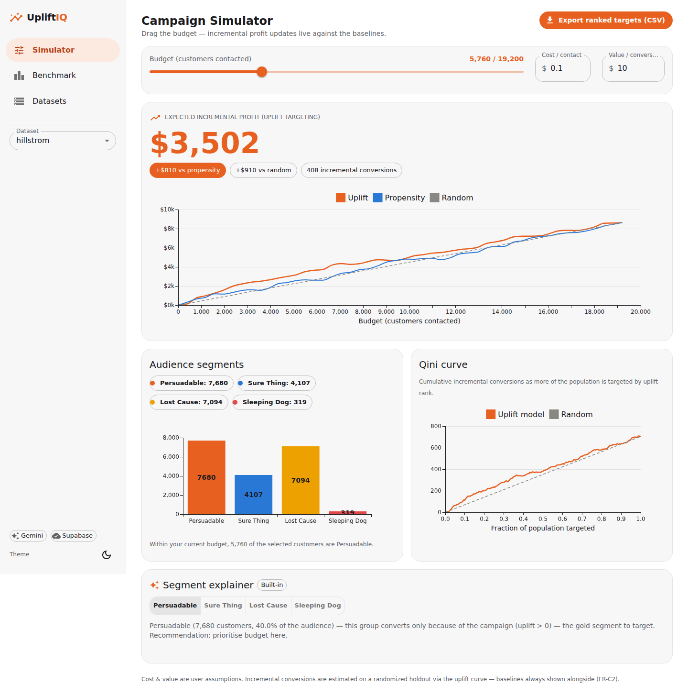

# UpliftIQ — Incremental Targeting Decision Engine

> *"Who buys **because of** the campaign — not merely who buys?"*

UpliftIQ benchmarks uplift (CATE) meta-learners on randomized experiments, then
wraps the best model in a deployed decision engine that picks whom to target
under a budget and reports the **incremental profit** versus conventional
targeting. Built to the two specs in [`docs/`](docs/).

The statistical core is **causal inference** (estimating the Conditional Average
Treatment Effect); the API, simulator, and dashboard make those statistics
**decision-grade**.



---

## What's inside

| Plane | Path | What it does |
|---|---|---|
| **Train** (thesis core) | `pipeline/` | ingest ▸ balance-check ▸ S/T/X/R-learners ▸ Qini/AUUC/decile/calibration ▸ pick best ▸ decision benchmark ▸ report |
| **Serve** | `api/` | FastAPI `/score` `/simulate` `/batch` `/export` `/metrics` `/explain` `/health` |
| **Experience** | `web/` | Next.js + MUI PWA — sidebar app with **Simulator**, **Benchmark**, and **Datasets** views |
| **Store** | `supabase/` | optional Supabase (Postgres) score store |

### The web app (sidebar navigation)
- **Simulator** — budget slider → live incremental profit vs propensity/random baselines,
  segment mix, Qini curve, Gemini segment explainer, one-click CSV export.
- **Benchmark** — meta-learner comparison table (Qini/AUUC, winner highlighted),
  uplift-by-decile + Qini charts for the winning model, experiment-balance
  diagnostics, and the embedded *"why not accuracy/AUC"* explainer (FR-D1).
- **Datasets** — diagnostics cards per scored dataset; the sidebar's dataset
  selector drives every page.

Typography is **Google Sans** (now served by Google Fonts) with the
`Roboto / Inter / Noto Sans Thai` fallback stack. Chart colors are validated for
contrast + color-vision-deficiency in both light and dark modes (uplift =
brand orange hero, propensity = blue, random = dashed reference line).

### Models (RO-2)
- **S-learner**, **T-learner**, **X-learner** (mandatory meta-learners)
- **R-learner** (Nie & Wager) — the advanced estimator, implemented without
  heavyweight deps so the benchmark always runs.

### Evaluation (FR-A5, FR-D1) — *uplift-appropriate only*
Qini coefficient, AUUC, uplift-by-decile, calibration — on a randomized
holdout. **Accuracy/AUC are never used as the uplift metric**, and the report
states why.

---

## Quick start (no keys needed)

Everything runs locally with **zero cloud setup** — Supabase and Gemini are
optional upgrades that activate only when their keys are present.

```bash
# 1. backend
python3 -m venv .venv && . .venv/bin/activate
pip install -r requirements.txt

# 2. run the seeded pipeline (downloads Hillstrom, ~5 s)
python -m pipeline.run --dataset hillstrom --seed 42
#   -> scores/hillstrom.parquet, models/hillstrom/, reports/hillstrom/report.md

# 3. serve
uvicorn api.main:app --port 8000        # API on :8000

# 4. simulator (separate shell)
cd web && npm install && npm run dev     # PWA on :3000
```

Open **http://localhost:3000**, drag the budget slider, watch the incremental
profit update live above the baselines.

### One-command Docker demo
```bash
cp .env.example .env        # optionally add GEMINI / SUPABASE keys
docker compose up --build   # train -> api(:8000) -> web(:3000)
```

---

## The headline result (AC-3)

At a fixed budget, **uplift targeting earns more incremental profit than
propensity or random targeting** — quantified on a randomized holdout via the
uplift-curve estimator (so the comparison is honest, FR-D2). Example
(Hillstrom, seed 42, budget = 30% of holdout, cost \$0.10, value \$10):

| Policy | Incremental conversions | Incremental profit |
|---|---|---|
| **Uplift** | ~408 | **~\$3,502** |
| Propensity | ~327 | ~\$2,692 |
| Random | ~317 | ~\$2,592 |

→ **~\$810 more profit than propensity targeting** at the same spend. Regenerate
with `python -m pipeline.run --dataset hillstrom --seed 42` (reproducible to the
decimal, AC-5). Full numbers + figures land in `reports/hillstrom/report.md`.

---

## Configuration — `.env`

Copy `.env.example` → `.env`. All keys optional:

| Var | Purpose |
|---|---|
| `SEED`, `DEFAULT_DATASET` | reproducibility / which dataset the demo serves |
| `GEMINI_API_KEY`, `GEMINI_MODEL` | LLM segment explainer (FR-C5); falls back to a built-in explainer |
| `SUPABASE_URL`, `SUPABASE_SERVICE_KEY` | shared score store; falls back to local Parquet |
| `NEXT_PUBLIC_API_BASE` | browser → API base URL |

**Supabase setup:** run [`supabase/schema.sql`](supabase/schema.sql) once in the
Supabase SQL editor, set the two env vars, re-run the pipeline — scores upsert
automatically and the API reads them back.

**Gemini setup:** get a key at <https://aistudio.google.com/app/apikey>, set
`GEMINI_API_KEY`. The `/api/explain` endpoint and the simulator's Segment
Explainer then use Gemini; without it they use a deterministic template.

---

## Datasets (FR-A1, RO-5)
- **Hillstrom** (64k, default) — `--dataset hillstrom`
- **Criteo** v2.1 (scale, NFR-3; subsampled for dev) — `--dataset criteo`
- **synthetic** (offline tests/demo) — `--dataset synthetic`

All via `scikit-uplift` loaders, normalised to one common frame
(`f_*`, `treatment`, `outcome`, `outcome_value`).

---

## Tests
```bash
python -m pytest tests/ -q
```
Covers: randomization/balance, all learners fit+predict, seeded reproducibility
(AC-5), Qini > 0 on signal, top-decile > bottom-decile (AC-2), uplift ≥ baseline
profit (AC-3), API ↔ offline agreement, UTF-8 BOM export (AC-7), explainer
fallback.

---

## Repository layout
```
upliftiq/
├─ pipeline/   data, balance, models (S/T/X/R), evaluate, decision, run, report
├─ api/        FastAPI app, loaders, gemini explainer
├─ web/        Next.js PWA (theme.ts, components/, app/, public/ PWA assets)
├─ supabase/   schema.sql
├─ tests/      pytest suite
├─ docs/       the two specs
├─ models/ scores/ reports/   generated artifacts
├─ Dockerfile.api  web/Dockerfile  docker-compose.yml  Makefile
└─ .env.example  requirements.txt
```

See [`docs/UpliftIQ_01_REQUIREMENT_SPEC.md`](docs/UpliftIQ_01_REQUIREMENT_SPEC.md)
and [`docs/UpliftIQ_02_SOFTWARE_SPEC.md`](docs/UpliftIQ_02_SOFTWARE_SPEC.md).
