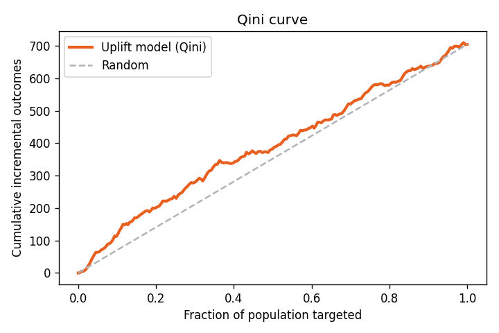
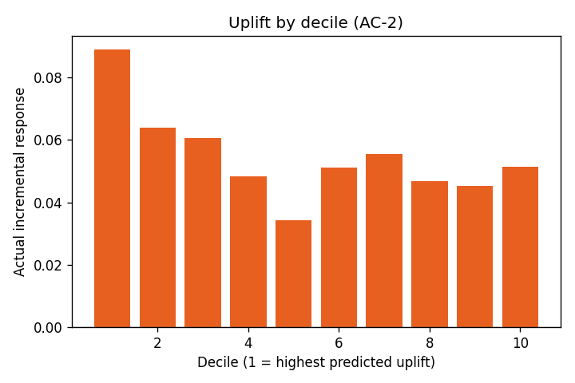
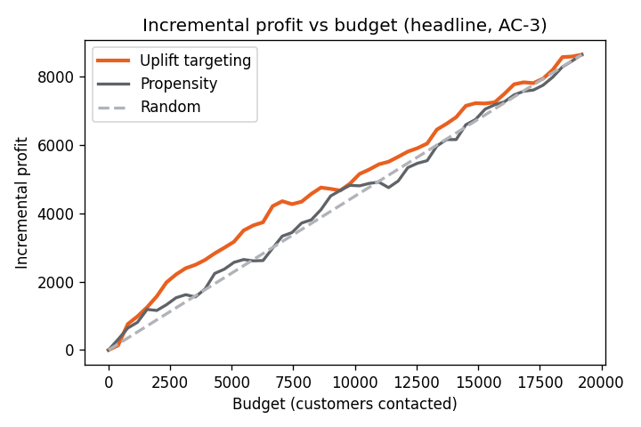

# UpliftIQ — Evaluation Report · `hillstrom`

*Seeded run (seed = 42). Reproduce with*
`python -m pipeline.run --dataset hillstrom --seed 42`.

- **Rows:** 64,000 (holdout 19,200)
- **Best learner (by Qini):** **s_learner**
- **Elapsed:** 5.0s

## 1. Experiment balance (FR-A2)
Treatment ratio **0.667** · max |SMD|
**0.015** · flagged features
**0** · randomization
**OK**.

## 2. Model benchmark (FR-A3–A5)
Evaluated on a randomized holdout with **uplift-appropriate metrics only**.

| Learner | Qini | AUUC | Ranks uplift? |
|---|---|---|---|
| s_learner | 0.0235 | 0.0132 | ✅ |
| t_learner | 0.0200 | 0.0113 | ✅ |
| x_learner | 0.0223 | 0.0131 | ✅ |
| r_learner | -0.0007 | -0.0006 | ⚠️ |

> **Why not accuracy/AUC?** Accuracy/AUC measure outcome prediction, not treatment effect. Under the fundamental problem of causal inference only one potential outcome is observed per customer, so individual uplift has no ground-truth label. Uplift is therefore evaluated at the group level on a randomized holdout via Qini/AUUC, never accuracy/AUC (FR-D1).

## 3. Uplift by decile (AC-2)
Top deciles should show materially higher actual incremental response than the
bottom — evidence the model *ranks* uplift, not just outcome.

| percentile   |   n_treatment |   n_control |    uplift |
|:-------------|--------------:|------------:|----------:|
| 0-10         |          1306 |         614 | 0.088963  |
| 10-20        |          1272 |         648 | 0.0639704 |
| 20-30        |          1323 |         597 | 0.0607003 |
| 30-40        |          1272 |         648 | 0.0483636 |
| 40-50        |          1258 |         662 | 0.0343229 |
| 50-60        |          1285 |         635 | 0.0511106 |
| 60-70        |          1250 |         670 | 0.0554149 |
| 70-80        |          1277 |         643 | 0.0469254 |
| 80-90        |          1293 |         627 | 0.0453528 |
| 90-100       |          1272 |         648 | 0.0514792 |

## 4. Calibration
Predicted vs observed uplift per bin.

|   bin |    n |   predicted_uplift |   observed_uplift |
|------:|-----:|-------------------:|------------------:|
|     1 | 1920 |          0.136793  |         0.088963  |
|     2 | 1920 |          0.0946104 |         0.0639704 |
|     3 | 1920 |          0.0805214 |         0.0607003 |
|     4 | 1920 |          0.0707496 |         0.0483636 |
|     5 | 1920 |          0.0620463 |         0.0338053 |
|     6 | 1920 |          0.0540478 |         0.0516408 |
|     7 | 1920 |          0.0462727 |         0.0554149 |
|     8 | 1920 |          0.0387651 |         0.0487132 |
|     9 | 1920 |          0.029337  |         0.0431704 |
|    10 | 1920 |          0.010498  |         0.0517008 |

## 5. Decision benchmark — the headline (AC-3)
At budget **5,760** (cost 0.1/contact,
value 10.0/conversion):

| Policy | Incremental conversions | Incremental profit |
|---|---|---|
| **Uplift** | 407.8 | **3502.1** |
| Propensity | 326.8 | 2692.5 |
| Random | 316.8 | 2591.6 |

**Profit lift of uplift vs propensity: 809.6**
· vs random: 910.5.

---
*Generated by `pipeline/report.py`. All figures regenerate from the seeded pipeline (FR-D3).*
