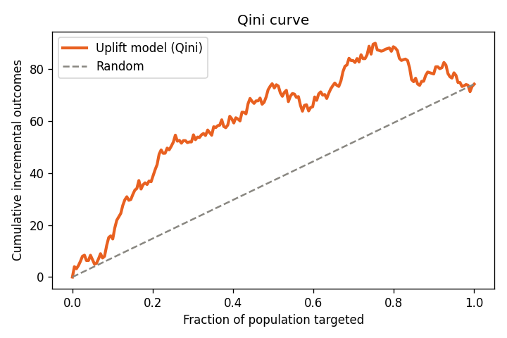
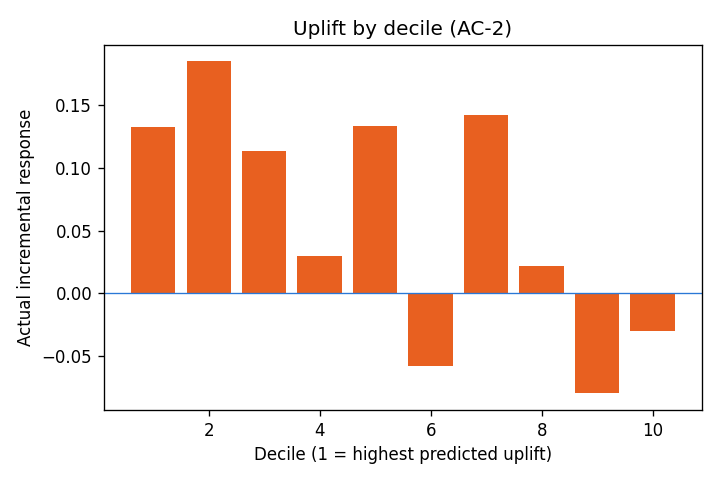
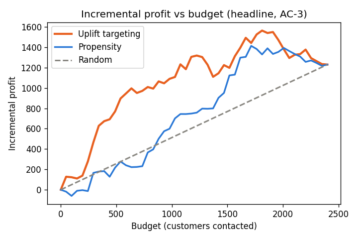

# UpliftIQ — Evaluation Report · `synthetic`

*Seeded run (seed = 42). Reproduce with*
`python -m pipeline.run --dataset synthetic --seed 42`.

- **Rows:** 8,000 (holdout 2,400)
- **Best learner (by Qini):** **s_learner**
- **Elapsed:** 2.6s

## 1. Experiment balance (FR-A2)
Treatment ratio **0.505** · max |SMD|
**0.039** · flagged features
**0** · randomization
**OK**.

## 2. Model benchmark (FR-A3–A5)
Evaluated on a randomized holdout with **uplift-appropriate metrics only**.

| Learner | Qini | AUUC | Ranks uplift? |
|---|---|---|---|
| s_learner | 0.0582 | 0.0681 | ✅ |
| t_learner | 0.0403 | 0.0476 | ✅ |
| x_learner | 0.0541 | 0.0645 | ✅ |
| r_learner | 0.0322 | 0.0383 | ✅ |

> **Why not accuracy/AUC?** Accuracy/AUC measure outcome prediction, not treatment effect. Under the fundamental problem of causal inference only one potential outcome is observed per customer, so individual uplift has no ground-truth label. Uplift is therefore evaluated at the group level on a randomized holdout via Qini/AUUC, never accuracy/AUC (FR-D1).

## 3. Uplift by decile (AC-2)
Top deciles should show materially higher actual incremental response than the
bottom — evidence the model *ranks* uplift, not just outcome.

| percentile   |   n_treatment |   n_control |     uplift |
|:-------------|--------------:|------------:|-----------:|
| 0-10         |           115 |         125 |  0.13287   |
| 10-20        |           122 |         118 |  0.185051  |
| 20-30        |           128 |         112 |  0.113839  |
| 30-40        |           131 |         109 |  0.0299041 |
| 40-50        |           120 |         120 |  0.133333  |
| 50-60        |           112 |         128 | -0.0580357 |
| 60-70        |           121 |         119 |  0.142371  |
| 70-80        |           124 |         116 |  0.0222469 |
| 80-90        |           111 |         129 | -0.079824  |
| 90-100       |           129 |         111 | -0.0297507 |

## 4. Calibration
Predicted vs observed uplift per bin.

|   bin |   n |   predicted_uplift |   observed_uplift |
|------:|----:|-------------------:|------------------:|
|     1 | 240 |         0.191696   |         0.13287   |
|     2 | 240 |         0.107463   |         0.185051  |
|     3 | 240 |         0.0744531  |         0.113839  |
|     4 | 240 |         0.0523133  |         0.0299041 |
|     5 | 240 |         0.0360741  |         0.133333  |
|     6 | 240 |         0.0230277  |        -0.0580357 |
|     7 | 240 |         0.011517   |         0.142371  |
|     8 | 240 |         0.00050317 |         0.0222469 |
|     9 | 240 |        -0.0142388  |        -0.079824  |
|    10 | 240 |        -0.045795   |        -0.0297507 |

## 5. Decision benchmark — the headline (AC-3)
At budget **720** (cost 0.1/contact,
value 10.0/conversion):

| Policy | Incremental conversions | Incremental profit |
|---|---|---|
| **Uplift** | 105.3 | **981.3** |
| Propensity | 39.5 | 322.7 |
| Random | 44.1 | 369.1 |

**Profit lift of uplift vs propensity: 658.6**
· vs random: 612.1.

---
*Generated by `pipeline/report.py`. All figures regenerate from the seeded pipeline (FR-D3).*
